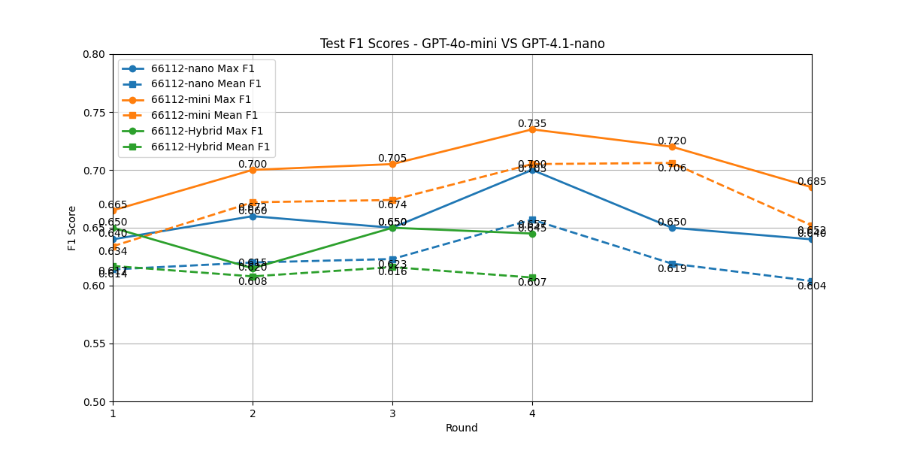

# Task
Utilizing LLMs as Academic Chairs for Top ML Conferences

## Background 
This study focuses on optimizing nonparametric algorithms for academic paper review decisions. The original ProTeGi algorithm from the paper was implemented without hyperparameter optimization. This work explores various hyperparameter combinations to enhance generalization performance, building upon previous human prompting results.

### Previous Results
#### Biased Prompt 
- Prompt: 
`Analyze the reviews provided, decide if the paper in question would be accepted at an academic conference. The vast majority of papers are accepted. About 0.05 of papers are rejected at the conference. Answer only ACCEPT or REJECT`
- Performance: Test F1 - 4o-mini: 0.75

#### Neutral Prompts (used as `Task` section in prompt template)
- Option 1: 
`Given the following reviews (text), determine if a paper would be accepted (Yes) or not (No) by an academic conference.`
   - Test F1 - 4o-mini: 0.692
   - Test F1 - 4.1-nano: 0.55

- Option 2: 
`Given the following reviews, determine if the paper being reviewed would be accepted at an academic conference.`
   - Test F1 - 4o-mini: 0.65
   - Test F1 - 4.1-nano: 0.525

## Experimental Setup

### Dataset Configuration
- Source: venue_id = '[NeurIPS.cc/2024/Conference](https://neurips.cc/Conferences/2024)'
- Training dataset: 800 accept + 800 reject
- Test dataset: 800 accept + 800 reject
- Test data: 100 accept + 100 reject

### Model Configuration
- Models: ["gpt-4o-mini", "gpt-4.1-nano"]
- Evaluation Models: ["gpt-4o-mini", "gpt-4.1-nano"]
- Beam Size: 5
- Test Examples: 200

### Hyperparameter Configurations

#### Expansion Hyperparameters
Parameters: 
- ["n_gradients", "errors_per_gradient", "gradients_per_error", "steps_per_gradient", "mc_samples_per_step", "max_expansion_factor"]

- Combos: 
    - [4, 4, 1, 1, 2, 8],   (paper default)
    - [4, 4, 3, 2, 0, 6],   Referred to as '44320-6' 
    - [4, 4, 3, 1, 0, 6]
    - [4, 4, 3, 1, 1, 6]
    - [4, 4, 3, 1, 2, 6]
    - [6, 4, 3, 2, 0, 6]
    - [6, 4, 3, 2, 0, 8]
    - [6, 4, 3, 2, 0, 8]
    - [6, 6, 1, 1, 2, 6]

<!-- | Combo ID | Configuration | Description |
|:---:|:---:|:---:|
| 0 | [4, 4, 1, 1, 2, 8] | paper default |
| 1 | [4, 4, 3, 2, 0, 6] | Referred to as '44320-6' |
| 2 | [4, 4, 3, 1, 0, 6] | Referred to as '44310-6' |
| 3 | [4, 4, 3, 1, 1, 6] | Referred to as '44311-6' |
| 4 | [4, 4, 3, 1, 2, 6] | Referred to as '44312-6' |
| 5 | [6, 4, 3, 2, 0, 6] | Referred to as '64320-6' |
| 6 | [6, 4, 3, 2, 0, 8] | Referred to as '64320-8' |
| 7 | [6, 4, 3, 2, 0, 8] | Referred to as '64320-8' |
| 8 | [6, 6, 1, 1, 2, 6] | Referred to as '66112-6' | -->

#### Evaluation Parameters
- Evaluators: ["bf", "ucb"]
- Configurations:
  - Combo 0: [8, 8, 32], eval_budget: 2048 (paper default)
  - Combo 1: [5, 3, 4], eval_budget: 60
  - Combo 2: [5, 3, 8], eval_budget: 120
  - Combo 3: [5, 6, 8], eval_budget: 240
  - Combo 4: [5, 8, 16], eval_budget: 640
  - Combo 5: [10, 5, 16], eval_budget: 800

## Results and Analysis

#### Evaluation Budget Impact
The paper has shown that most of the algorithms improved as the budget increases. The evaluation budget is calculated as:
```
config['eval_budget'] = config['samples_per_eval'] * config['eval_rounds'] * config['eval_prompts_per_round']
```

To manage costs, I initially used GPT 4.1-nano. Since eval_budget is determined by three hyperparameters, I selected the 'bf' evaluator over 'ucb' evaluator to isolate the impact of eval_budget on test performance (F1). This choice ensured that eval_budget was the sole parameter in prompt election step. All reported test F1 scores are derived from majority voting across 5 trials, using maxpooling over the beams of candidates starting from the 3rd optimization step.

As shown in Table 1, while the eval_budget ranges from 150 to 800, the test F1 scores remain relatively stable between 0.65 and 0.7 (GPT 4.1-nano), indicating that increasing the evaluation budget does not lead to significant performance improvements. Notably, the sampled training data (`"minibatch_size": 64`) F1 scores can reach over 90% performance around 3 optimization steps, suggesting potential overfitting on the training data, which is consistent with findings in the original paper.

##### Table 1: BF Evaluator Performance (GPT 4.1-nano)

| Eval_budget | 150 | 240 | 360 | 600 | 800 |
|:---:|:---:|:---:|:---:|:---:|:---:|
| Prompts for Eval | 30 | 30 | 30 | 40 | 40 |
| **Test F1 Score** | **0.665** | **0.69** | **0.655** | **0.665** | **0.67** |

Given the best combo of expansion hyperparameters, proved by later experiments, using GPT 4o-mini alone and using UCB Bandits selection with an eval_budget as small as **60** could suffice the process for prompt selection, with test F1 scores between 0.73 and 0.75 (GPT 4o-mini), shown in Table 2 below.

##### Table 2: UCB Evaluator Performance (GPT 4o-mini)
| Eval_budget | 60 | 120 | 240 | 640 |
|:---:|:---:|:---:|:---:|:---:|
| Prompts for Eval | 30 | 30 | 30 | 60 |
| **Test F1 Score** | **0.74** | **0.745** | **0.75/0.735** | **0.73** |
| Peak Round | 5 | 5 | 4 | 3 |

#### Expansion Hyperparameter Analysis
Table 3 and Table 4 present several combinations of hyperparameters used in the prompt expansion process. The total number of generated prompts (before filtering) is determined by 5 key hyperparameters. Both tables demonstrate that the combination '44320-6' consistently outperforms others, achieving a **75%** test performance while maintaining relatively low computational costs (API calls). In this context, UCB Bandits shows limited advantage due to the small evaluation budget. Additionally, the results suggest that generating more gradient variations is more effective than creating prompt synonyms for discovering high-quality candidates.

##### Table 3: BF Evaluator Results (GPT4o-mini, Eval Budget: 240)
| Expansion Combo | 44112-8 | 44310-6 | 44311-6 | 44320-6 | 64320-6 | 66112-6 |
|:---:|:---:|:---:|:---:|:---:|:---:|:---:|
| **Test F1 Score** | **0.715** | **0.72** | **0.73** | **0.76/0.74** | **0.75** | **0.725** |
| Peak Round | 4 | 3 | 4 | 6 | 4 | 4 |
| Total API calls | 4+1+4+5(14) | 4+1+12(17) | 4+1+12+13(30) | 4+1+12(17) | 6+1+18(25) | 6+1+6+7(20) |
| Count of New Prompts | 14 | 12 | 25 | 24 | 36 | 20 |

##### Table 4: UCB Evaluator Results (GPT4o-mini, Eval Budget: 240)
| Expansion Combo | 44312-6 | 44610-6 | 48520-6 | 44320-6 | 64320-8 | 66112-6 |
|:---:|:---:|:---:|:---:|:---:|:---:|:---:|
| **Test F1 Score** | **0.73** | **0.745** | **0.725** | **0.75/0.735** | **0.725** | **0.735** |
| Peak Round | 3 | 5 | 5 | 4 | 4 | 4 |
| Total API calls | 4+1+12+13(30) | 4+1+24(29) | 4+1+20(25) | 4+1+12(17) | 6+1+18(25) | 6+1+6+7(20) |
| Count of New Prompts | 38 | 24 | 40 | 24 | 36 | 20 |

#### Learning Curve (GPT 4o-min VS GPT 4.1-nano)

##### Hybrid Model Definition
- GPT-4o-mini: Reasoning tasks (gradients, prompt synonyms)
- GPT 4.1-nano: Scoring and evaluation (F1-based)

##### Model Comparison: GPT 4o-mini vs GPT 4.1-nano vs Hybrid

Performance Comparison:
- GPT-4o-mini shows 5~7% improvement over both GPT-4.1-nano and Hybrid
- Hybrid model performance varies with expansion hyperparameters, compared to GPT-4.1-nano

[Figures 1 and 2 show detailed performance comparisons]
<div align="center">

</div>
<div align="center">

</div>

#### Impact of UCB Exploration Parameter c
##### Table 5:  Model Performance on c (GPT 4o-mini, Eval Budget: 60)

| UCB-44320-6 (4o-mini) | 5 x 3 x 4 - c2.0 | 5 x 3 x 4 - c1.0 |
|:---:|:---:|:---:|
| **Test F1 Score** | **0.74** | **0.725** |
| Peak Round | 5 | 4 |

#### Observations on Gradient Prompt
Original prompt maintains consistent feedback count while Modified prompt shows improved performance but increased instability. For example, Modified prompt may return variable feedback counts if the variable *num_feedbacks = 1,*

##### Original Prompt (Paper)
```
I'm trying to write a zero-shot classifier prompt.

My current prompt is:
"{prompt}"

But this prompt gets the following examples wrong:
{error_string}

give {num_feedbacks} reasons why the prompt could have gotten these examples wrong.
Wrap each reason with <START> and <END>
```

##### Modified Prompt 01
```
I'm trying to write a zero-shot classifier prompt.

My current prompt is:
"{prompt}"

But this prompt gets the following examples wrong:
{error_string}

give {num_feedbacks} different reasons why the prompt incorrectly classified these examples.
Wrap each reason with <START> and <END>
```

##### Table 6: Gradient Prompt Performance Comparison
| Test F1/ Peak Step |  44112-8 | 44320-6 |
|:---:|:---:|:---:|
| Original Prompt | 0.71 / R6 | 0.685 / R5 |
| Modified Prompt | 0.715 / R4 | 0.75 / R6 |


    

